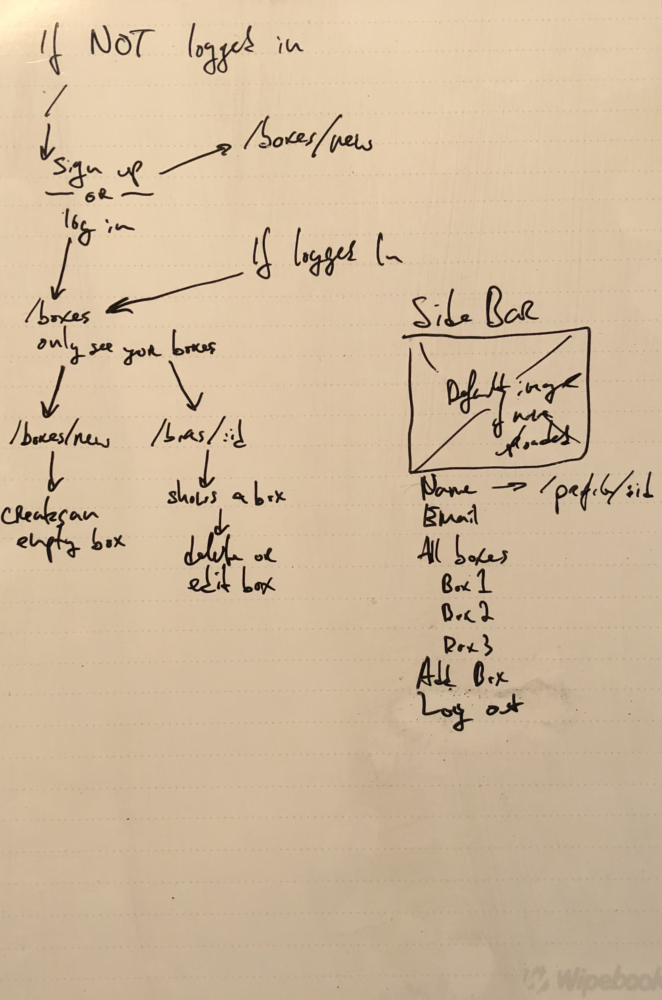

# musicBox

musicBox is music organization web application using NodeJS, Express, MongoDB and React. musicBox allows users to create 'boxes' where they can hold up to 5 tracks. Using the Spotify API, users can search for tracks and add them to thier 'boxes', which they can create an unlimited amount of and can edit and view them from a list. 

The most attractive aspect of musicBox is its minimalist approach to music collections. The deluge of playlists and other related content, curated or otherwise, is overwhelming - with many items getting lost in the fold. musicBox focuses users, demanding creativity and a minimalist approach to an otherwise uncreative and overbearing industry. 

[Visit musicBox](https://mighty-ravine-55140.herokuapp.com/ "musicBox")

### Technologies Used
* HTML
* CSS
* NodeJS
* Express
* [Materialize CSS Framework](http://materializecss.com/)
* React
* MongoDB
* Spotify API
* Deployed on [Heroku](https://www.heroku.com/)
* NPM
	* Axios, Body-parser, dotenv, JSON Web Tokens, Mongoose, morgan, node-spotify-api, React-DOM, React-Router-DOM

### Stories
* I am a user and I want to: 
	* create an account and log in
	* create a music box with a custom name
	* add songs to my boxes
	* edit songs
	* delete boxes

### Approach
The ideation phase began with a basic concept: how minimally can music be stored and organized? Limiting the amount of songs users could collect, while giving them near-unlimited choices is a paradoxically essential aspect of musicBox. 

Basic Wireframe

User Flow

The next step was building the backend. Two models, controllers and routers make up the musicBox API. The third step was design, which was facilitated by the Materialize CSS Framework. Forms, Modals, Cards and NavBars make up the front end.

Sign up

Viewing all boxes

Adding a new box

Viewing a specific box

The app is rounded out by the utilization of the Spotify API through the node-spotify-api NPM package. 

### Installation

To run musicBox locally:

* Clone this repo to your machine
* Cd into the app
* Run 'npm install'
* Cd into Client and run 'npm intstall && npm start'
* Open 'localhost:3000' in your browser

### Future Work

musicBox needs additional functionality. First, each box needs to be shareable. Second, tracks need to have embedded Spotify players so music could be listened to inside the app. Third, Spotify's API has so much to offer and this app should utilize much more of it - including track details, audio features and audio analysis of tracks. Fourth, in addition to tracks, albums and artists could also be added. 

Additional styling and debugging also is required. 

