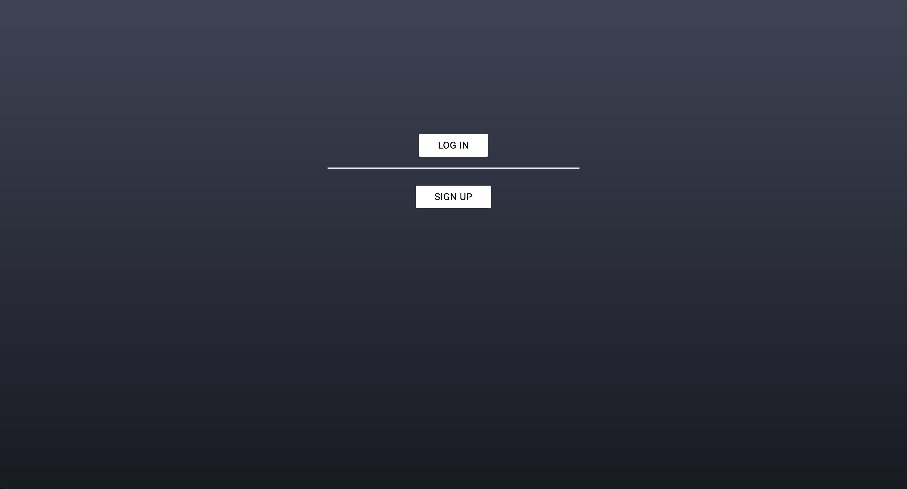
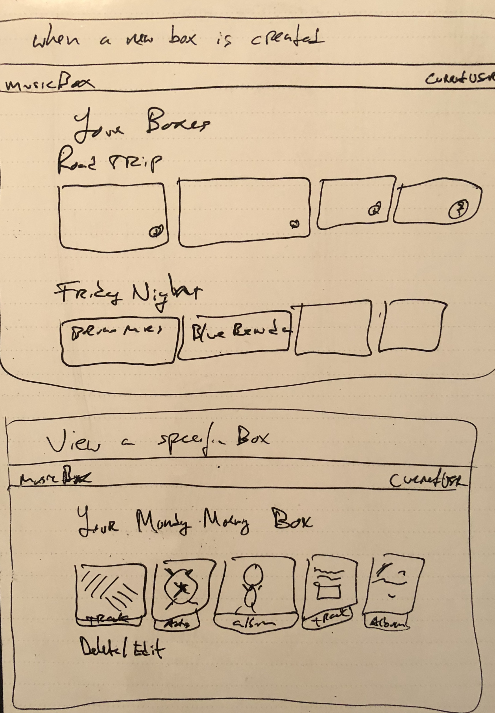
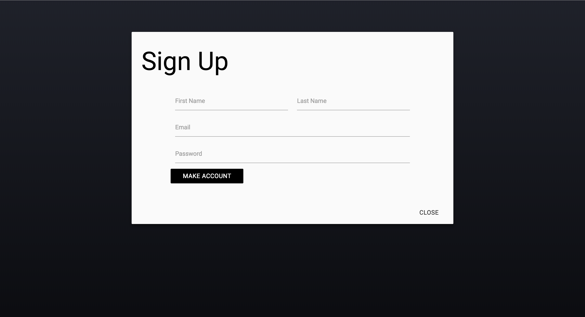
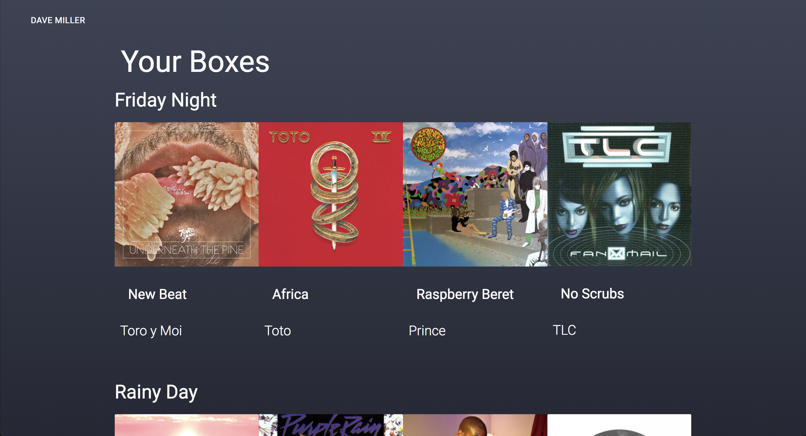
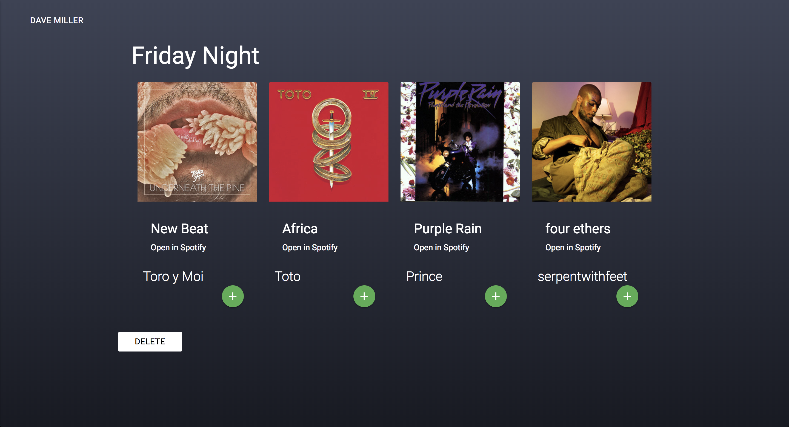

# musicBox

musicBox is music organization web application using NodeJS, Express, MongoDB and React. musicBox allows users to create 'boxes' where they can hold up to 5 tracks. Using the Spotify API, users can search for tracks and add them to thier 'boxes', which they can create an unlimited amount of and can edit and view them from a list. 

The most attractive aspect of musicBox is its minimalist approach to music collections. The deluge of playlists and other related content, curated or otherwise, is overwhelming - with many items getting lost in the fold. musicBox focuses users, demanding creativity and a minimalist approach to an otherwise uncreative and overbearing industry. 

[Visit musicBox](https://infinite-inlet-15903.herokuapp.com/ "DMEconnect")

### Technologies Used
* HTML
* CSS
* NodeJS
* Express
* [Materialize CSS Framework](http://materializecss.com/)
* React
* MongoDB
* Spotify API
* Deployed on [Heroku](https://www.heroku.com/)
* NPM
	* Axios, Body-parser, dotenv, JSON Web Tokens, Mongoose, morgan, node-spotify-api, React-DOM, React-Router-DOM

### Stories

### Approach
The idea for this web app came from a real-world need to better communicate within my organization. Scattered text and Facebook messages led to an unorganized and inefficient process. 

Basic Wireframe

I began by wireframing with Balsamiq. This helped me develop a general design and also aided in user flow.

Sign up

Viewing all boxes

Adding a new box

Viewing a specific box

Work began with basic design, then moved to functionality. Adding events, shareables and EPK change requests was the first function to be compelted. I then moved onto admin permissions and user authentication and authorization. 

### Installation

To run musicBox locally:

* Clone this repo to your machine
* Cd into the app
* Run 'npm install'
* Cd into Client and run 'npm intstall && npm start'
* Open 'localhost:3000' in your browser

### Future Work

musicBox needs additional functionality. First, each box needs to be shareable. Second, tracks need to have embedded Spotify players so music could be listened to inside the app. Third, Spotify's API has so much to offer and this app should utilize much more of it - including track details, audio features and audio analysis of tracks. 

Additional styling and debugging also is required. 

